 

- 🔭 I’m currently working on ...
  finding a job.

- 🌱 I’m currently learning ...
rust.

- 👯 I’m looking to collaborate on ...
candi-date

- 📫 How to reach me: ...
- 😄 Pronouns: he/they
- ⚡ Fun fact: 
* i don't share fun facts.

